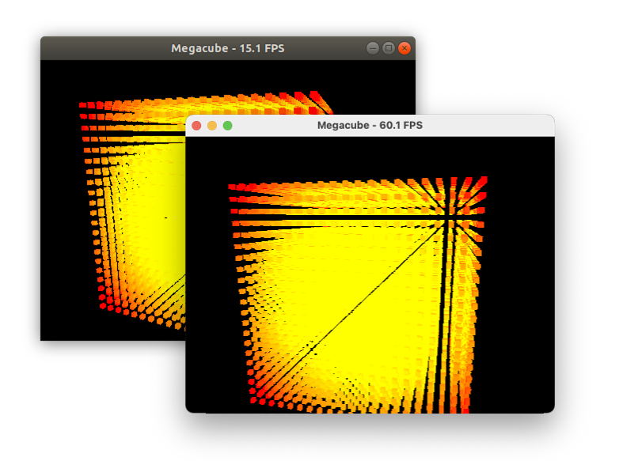

# GLScene for CrossVcl
This fork has modification which allow to use GLScene 2.0 together with CrossVcl (http://www.crossvcl.com) to build VCL application for macOS and Linux using Delphi.

# GLScene
GLScene is a graphic engine based on OpenGL and VCL components for Delphi and C++ Builder. 
It provides the tools and class library allowing description and rendering 3D scenes
for Win32/Win64 applications.
Additional support of CG, FMOD,  BASS,  ODE, NGD, CUDA, OpenCL, Graphics32 and SDL2 libraries.
